=================
Datos "Preciosos"
=================

Charla para `#DataScienceCordoba <http://www.meetup.com/Encuentros-Data-Science-Cordoba/>`_

-------

Una historia sobre Preciosa
------------------------------

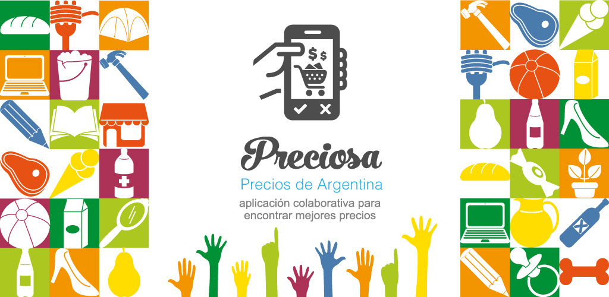

Martín Gaitán y Pablo Celayes

--------

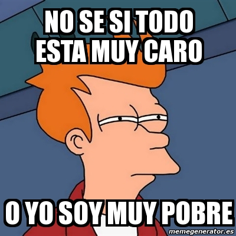

-------

Un poco de prehistoria
-----------------------

- Programa "Mirar para cuidar"
- *"bien, se asume el problema, pero esa solución no escala"*

.. image:: Captura de pantalla de 2015-03-04 14:54:18.png

-----

Mi experiencia "democrática"
-----------------------------

- Elecciones 2013: Sospechas de fraude al "FIT" en Córdoba

.. image:: Captura de pantalla de 2015-03-04 01:06:44.png
   :width: 70%

Más de 200 reportes de irregularidades en 2 dias

-------

Y la hicimos completa
------------------------

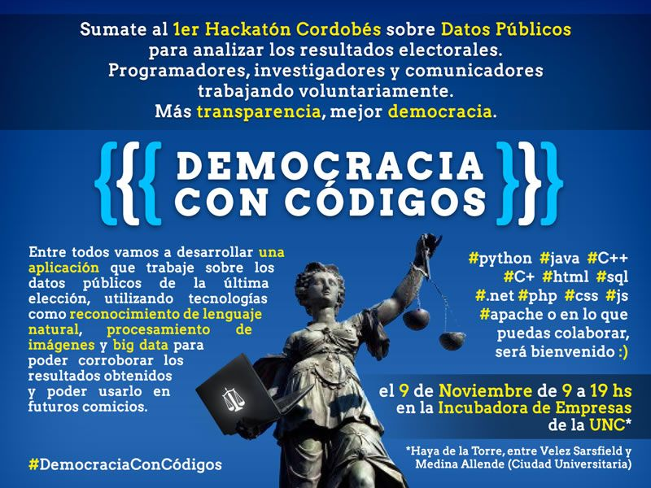

Más de 40 asistentes!

------------

Una hipotesis
-------------

La gente ayuda... si tiene un motivo

- solidario
- **económico**
- lúdico
- de ego/reconocimiento
- ideológico
- cívico (?)

y si le **es muy fácil**

-----------

Y todos queremos ahorrar
-------------------------

- Sin dejar de elegir lo que compramos

Los consumidores
	**"Somos muchos y nos conocemos poco"**

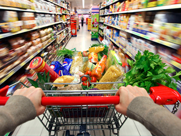

------------

Algunos, además, queremos contestar preguntas
----------------------------------------------

- ¿quienes "marcan" los precios?
- ¿cuánto aumentaron en promedio los productos de Unilever o Kraft en 2014?
- ¿los supermercados coordinan sus ofertas por rubro?
- ¿cuales son los precios de cada barrio para una misma canasta?
- cientos más!

------------

Necesitamos información para decidir
------------------------------------

¿por qué otros sí la tienen?

.. image:: http://www.trecebits.com/wp-content/uploads/2011/07/nasdaq2.jpg
   :width: 70%

------------------------------

Luego de mucho trabajo...
-------------------------

.. image:: Captura de pantalla de 2015-03-04 03:01:20.png
   :width: 80%

----

Con ustedes: Preciosa
--------------------------

Una aplicación **colaborativa** para encontrar mejores precios

---------

Cómo funciona
--------------

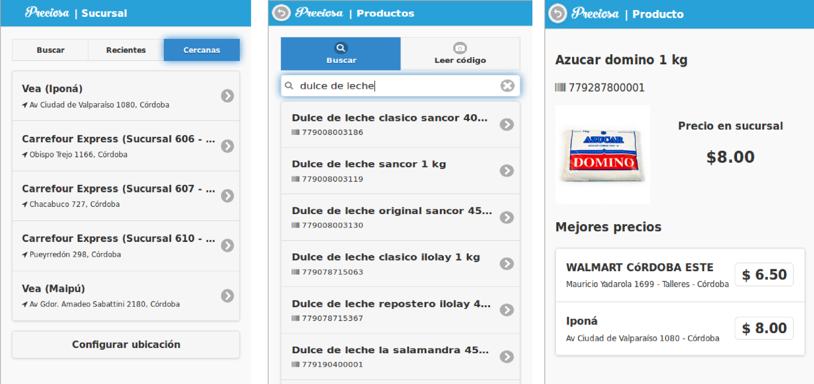

----------

El boom (?)
------------

- 1600 sucursales geolocalizadas
- +30k productos reconocibles
- 2k descargas en 3 semanas
- 400 usuarios activos
- increíble repercusión mediática

----

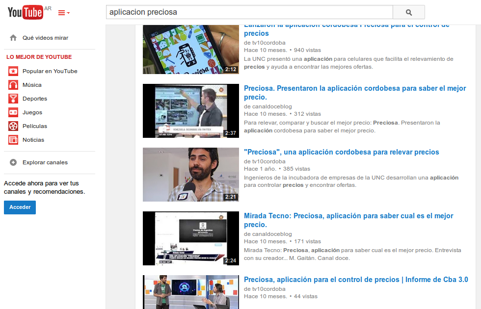

----

pero no hay que creerle a la tv
------------------------------------

- Condiciones adversas (3g, guardias, etc)
- Efecto "huevo-gallina"
- Baja **confianza de datos**
- Fácil, pero no tanto

.. image:: Captura de pantalla de 2015-03-04 02:10:07.png

-------

y el problema 0
----------------

mi **burnout**

--------

La idea pivot
-----------------

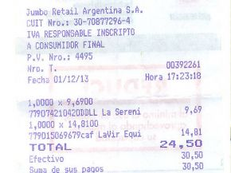

| + precios + confianza + fácil + usuarios

------

Dando un *motivo* para colaborar
---------------------------------

.. epigraph::

  Mandame una foto de tu último ticket y a cambio
    te digo el mejor precio para **toda** tu próxima lista de compras**

**Y de yapa...**
  Datos sobre **hábitos de consumo** de todo el pais

--------

Problema: conseguir plata
--------------------------

para dedicarme 100% y armar un equipo

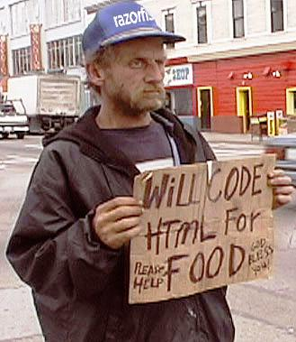

---------

No duré mucho intentando
------------------------

--------

Pero siempre que voy al super...
---------------------------------

quisiera poder usar Preciosa

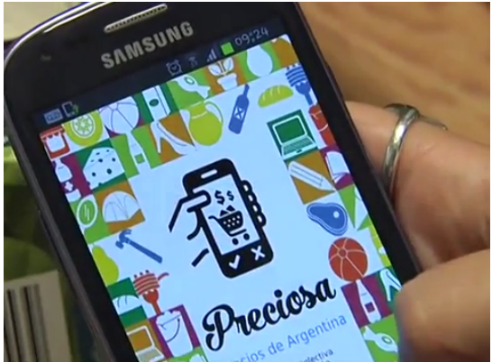

--------

|
|

¿y si se suman?
---------------

**www.preciosdeargentina.com.ar**

(gracias)

--------

Bonus Track: PreciosCienciA
===========================

-------

Detección de Fraude / Validación
--------------------------------
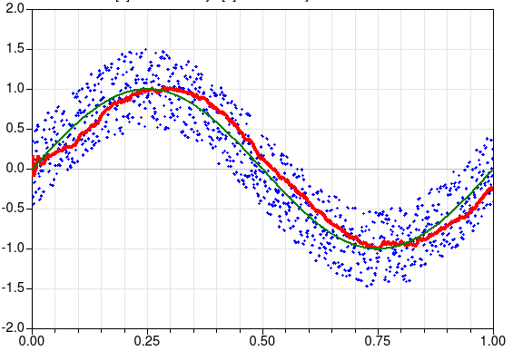

--------

Reportes & Análisis
-------------------

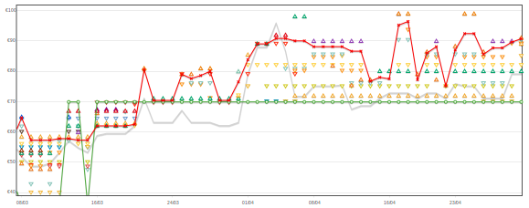
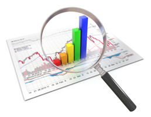

- Estudios de mercado
- Información al consumidor

--------

Lectura de tickets
------------------

--------

Changuito
---------

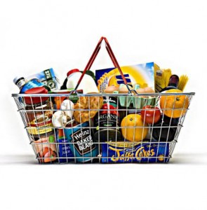
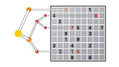

-------

Preguntas?
----------

.. image:: anyq.jpg

